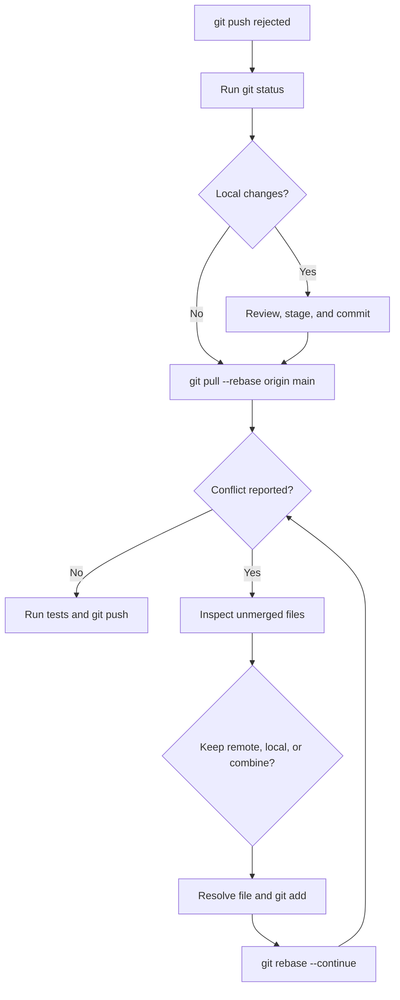

# Git Push Rejection and Rebase Conflict Troubleshooting

This guide explains why Git rejects a push when the remote branch is ahead,
why `git pull --rebase` can stop with conflicts, and how to recover without
losing local work.

The examples use the following repository:

```text
ytang19-glitch/panda_franka_robot
```

## Example failure

The local repository reported:

```text
On branch main
Your branch is behind 'origin/main' by 16 commits
```

After committing local work, `git pull --rebase origin main` reported:

```text
CONFLICT (add/add): Merge conflict in src/panda_nmpc/panda_nmpc/bridge.py
CONFLICT (content): Merge conflict in src/panda_nmpc/setup.py
CONFLICT (add/add): Merge conflict in
src/panda_reference_trajectories/src/cartesian_path_executor.cpp

error: could not apply 369261c...
```

A later push was rejected:

```text
! [rejected] main -> main (non-fast-forward)
error: failed to push some refs
```

This does **not** mean the local commit was deleted. Git paused the rebase
because it requires a human decision about overlapping changes.

## What caused the problem?

There were two independent histories:

```text
origin/main:  A---B---C---D---E
                       \
local main:             L
```

The remote branch contained commits that were not present locally, while the
local branch contained a new commit. Git could not push `L` directly because
doing so would omit the newer remote commits.

A rebase attempts to replay the local commit after the current remote history:

```text
origin/main: A---B---C---D---E
                              \
rebased local:                 L'
```

The replay stops when both histories changed the same file in incompatible
ways.

## Meaning of the messages

| Message | Meaning | Typical cause |
| --- | --- | --- |
| `behind origin/main by N commits` | GitHub contains commits that the local branch does not have. | GitHub was edited from another computer, browser, API, or collaborator. |
| `Changes not staged for commit` | Tracked files were modified locally but are not selected for the next commit. | Source files were edited after the last commit. |
| `Untracked files` | The files exist locally but Git has never committed them. | A new package, node, launch file, or configuration was created. |
| `non-fast-forward` | A push would replace or omit commits already on GitHub. | The remote branch moved forward before the local push. |
| `CONFLICT (content)` | Both histories edited overlapping parts of an existing file. | Both versions changed the same lines in `setup.py`. |
| `CONFLICT (add/add)` | Both histories independently created the same path. | Both local and remote created `bridge.py`. |
| `could not apply <commit>` | Rebase could not replay a local commit automatically. | At least one conflict needs a decision. |

## Safe resolution flowchart



## Step 1 — inspect before changing anything

```bash
cd ~/panda_franka_robot

git status
git branch --show-current
git remote -v
git diff --stat
git diff --check
```

Do not use `git restore`, `git reset --hard`, or delete files just because the
branch is behind. Those actions may discard local work and do not solve the
history difference.

## Step 2 — save intentional local work

Stage explicit paths so that build artifacts are not accidentally committed:

```bash
git add \
  src/panda_bringup/launch/pick_and_place.launch.xml \
  src/panda_moveit/config/kinematics.yaml \
  src/panda_moveit/launch/moveit.launch.py \
  src/panda_nmpc/panda_nmpc/nmpc_node.py \
  src/panda_nmpc/panda_nmpc/bridge.py \
  src/panda_nmpc/setup.py \
  src/panda_reference_trajectories

git diff --cached --stat

git commit -m "feat: add Cartesian motion planning and NMPC reference bridge"
```

Avoid `git add .` until `build/`, `install/`, and `log/` are confirmed in
`.gitignore`.

## Step 3 — integrate the remote history

```bash
git pull --rebase origin main
```

If there are no conflicts, test the workspace and push. If Git stops, do not run
another pull or push yet. First resolve the active rebase.

Check the conflict list:

```bash
git status
git diff --name-only --diff-filter=U
```

## Important: ours and theirs during rebase

The labels are easy to misunderstand.

During this command:

```bash
git pull --rebase origin main
```

the meanings are:

| Choice | Meaning during this rebase |
| --- | --- |
| `--ours` | The current upstream history from `origin/main`. |
| `--theirs` | The local commit currently being replayed. |

This is different from the intuitive meaning many users expect.

To inspect both versions without replacing the working file:

```bash
git show :2:path/to/file
git show :3:path/to/file
```

During this rebase, stage 2 is normally the upstream version and stage 3 is
normally the replayed local version. Always confirm with `git status` and the
file contents before making a decision.

## Resolution example from this repository

The conflicted files were:

```text
src/panda_nmpc/panda_nmpc/bridge.py
src/panda_nmpc/setup.py
src/panda_reference_trajectories/src/cartesian_path_executor.cpp
```

The selected resolution was:

| File | Version kept | Reason |
| --- | --- | --- |
| `bridge.py` | Remote/upstream | GitHub already contained the validated bridge documented by the package README. |
| `setup.py` | Remote/upstream | The GitHub version already registered both `nmpc_node` and `reference_bridge`. |
| `cartesian_path_executor.cpp` | Local/replayed commit | The local version was the newer version that had just compiled successfully. |

Apply that decision while the rebase is paused:

```bash
git checkout --ours -- \
  src/panda_nmpc/panda_nmpc/bridge.py \
  src/panda_nmpc/setup.py

git checkout --theirs -- \
  src/panda_reference_trajectories/src/cartesian_path_executor.cpp
```

This example is specific to this conflict. Do not automatically apply
`--ours` or `--theirs` to future conflicts without inspecting both versions.

## Manual combination example

Sometimes neither complete version should be discarded. Open the conflicted
file and look for markers such as:

```text
<<<<<<< HEAD
content from the upstream branch
=======
content from the local commit being replayed
>>>>>>> 369261c
```

For example, the final `setup.py` must preserve both console executables:

```python
"console_scripts": [
    "nmpc_node = panda_nmpc.nmpc_node:main",
    "reference_bridge = panda_nmpc.bridge:main",
],
```

Delete the conflict markers, combine the required content, save the file, and
verify that no marker remains:

```bash
grep -R -nE '^(<<<<<<<|=======|>>>>>>>)' \
  src/panda_nmpc \
  src/panda_reference_trajectories
```

No output is the desired result.

## Step 4 — mark the files as resolved

```bash
git add \
  src/panda_nmpc/panda_nmpc/bridge.py \
  src/panda_nmpc/setup.py \
  src/panda_reference_trajectories/src/cartesian_path_executor.cpp

git status
```

The files must no longer appear under `Unmerged paths`.

## Step 5 — continue the rebase

```bash
GIT_EDITOR=true git rebase --continue
```

If another conflict appears, repeat the inspect, resolve, `git add), and
`git rebase --continue` cycle.

A successful result looks like:

```text
Successfully rebased and updated refs/heads/main.
```

Do not use `git rebase --skip` unless the entire replayed commit is genuinely
unwanted. Skipping can discard all changes carried by that commit.

## Step 6 — rebuild and test before pushing

After resolving source-code conflicts, confirm that the selected combination
still compiles:

```bash
cd ~/panda_franka_robot
source /opt/ros/jazzy/setup.bash

colcon build \
  --packages-select panda_nmpc panda_reference_trajectories \
  --symlink-install

source install/setup.bash

ros2 pkg executables panda_nmpc
ros2 pkg executables panda_reference_trajectories
```

Expected executables include:

```text
panda_nmpc nmpc_node
panda_nmpc reference_bridge
panda_reference_trajectories cartesian_path_executor
panda_reference_trajectories reference_generator
```

## Step 7 — push only after the rebase succeeds

```bash
git status
git push origin main
```

Final verification:

```bash
git status
git log --oneline --decorate -10
```

The desired status is:

```text
On branch main
Your branch is up to date with 'origin/main'.

nothing to commit, working tree clean
```

## Recovery options

### Cancel the rebase and return to the pre-rebase state

Use this if the resolution becomes confusing:

```bash
git rebase --abort
```

The original local commit remains available. This is safer than deleting files
or resetting the repository.

### Find a previous commit

```bash
git reflog
```

The reflog records recent branch and rebase movements and can help locate the
original local commit, such as `369261c`.

### Do not force-push as a shortcut

Avoid:

```bash
git push --force
```

A force-push can overwrite the remote commits that caused the non-fast-forward
protection. If a force update is ever intentionally required, first understand
the shared branch impact and prefer `--force-with-lease`; it is not required
for the workflow in this guide.

## How to prevent the problem

Before beginning a new editing session:

```bash
cd ~/panda_franka_robot
git status
git pull --rebase origin main
```

During development:

```bash
git status
git add <specific-files>
git commit -m "describe one logical change"
```

Before pushing:

```bash
git pull --rebase origin main
# Run the relevant build and tests.
git push origin main
```

Additional habits:

- Pull before editing when the repository is modified from multiple computers
  or through GitHub web/API tools.
- Make small commits so conflicts are easier to understand.
- Do not commit `build/`, `install/`, or `log/`.
- Use a feature branch for larger changes.
- Run `git diff --cached` before every commit.
- Never resolve a conflict by blindly selecting all local or all remote files.

## Quick command summary

```bash
# Inspect
git status
git diff --name-only --diff-filter=U

# Resolve selected files, then stage them
git add <resolved-files>

# Continue
GIT_EDITOR=true git rebase --continue

# Verify and test
git status
colcon build --packages-select panda_nmpc panda_reference_trajectories --symlink-install

# Publish
git push origin main
```

The key rule is:

> Commit local work, rebase onto the latest remote history, resolve each
> overlapping file deliberately, test the combined result, and only then push.
