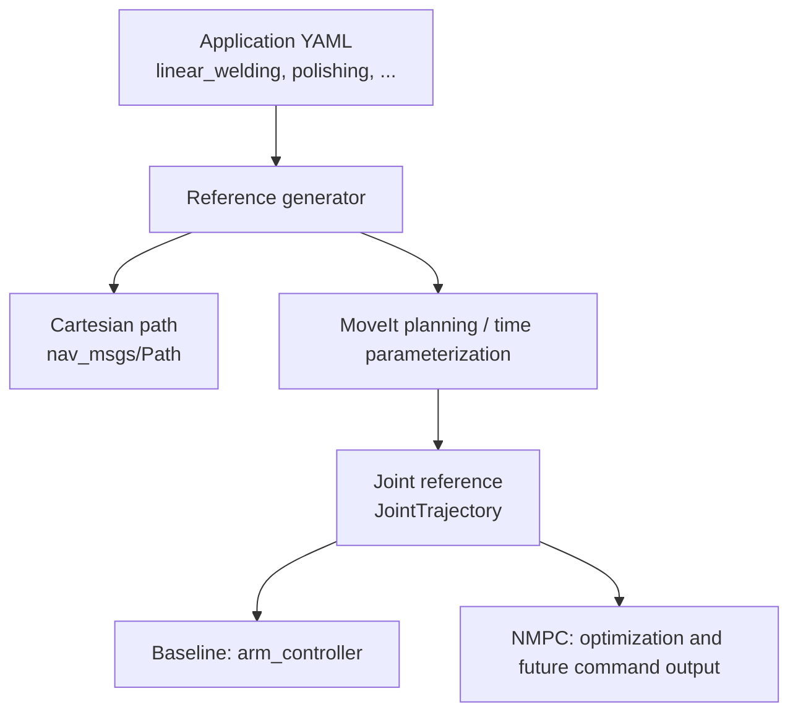

# Industrial Reference-Trajectory Package Setup

This guide adds a separate ROS 2 package named `panda_reference_trajectories`. Its job is to generate reusable Cartesian and joint-space reference trajectories for industrial-style tests such as welding, painting, polishing, inspection, machine tending, and pick-and-place.

> **Current status:** this document describes the package to build next. Creating empty files is only the scaffold; the node will not run until the C++ implementations and launch file are added. The existing `panda_nmpc` node is currently **read-only**: it computes an optimized velocity but does not command the robot. Keep all first tests in simulation.

## 1. Architecture



Use two naming levels:

- **C++ files describe geometry**: line, arc, spline, raster, point-to-point, approach/retract.
- **YAML files describe industrial applications**: welding, painting, polishing, inspection, and so on.

For example, do not create one large `welding.cpp`. A welding profile can reuse a line, arc, or spline and add process-specific speed, stand-off distance, and approach/retract parameters.

## 2. Create the package

Open a new terminal:

```bash
cd ~/panda_franka_robot
source /opt/ros/jazzy/setup.bash
source install/setup.bash

cd src
ros2 pkg create \
  --build-type ament_cmake \
  --license Apache-2.0 \
  --dependencies \
    rclcpp \
    geometry_msgs \
    nav_msgs \
    trajectory_msgs \
    moveit_msgs \
    moveit_core \
    moveit_ros_planning_interface \
    tf2_geometry_msgs \
  panda_reference_trajectories
```

Create the package folders:

```bash
cd ~/panda_franka_robot/src/panda_reference_trajectories

mkdir -p \
  config/applications \
  include/panda_reference_trajectories/generators \
  launch \
  src/generators \
  test
```

Create the planned files:

```bash
touch \
  README.md \
  config/applications/pick_and_place.yaml \
  config/applications/machine_tending.yaml \
  config/applications/linear_welding.yaml \
  config/applications/pipe_welding.yaml \
  config/applications/surface_cleaning.yaml \
  config/applications/spray_painting.yaml \
  config/applications/polishing.yaml \
  config/applications/adhesive_dispensing.yaml \
  config/applications/contour_inspection.yaml \
  config/applications/peg_insertion.yaml \
  launch/reference_experiment.launch.py \
  include/panda_reference_trajectories/reference_generator_node.hpp \
  include/panda_reference_trajectories/trajectory_builder.hpp \
  include/panda_reference_trajectories/generators/path_generator.hpp \
  src/reference_generator_node.cpp \
  src/trajectory_builder.cpp \
  src/generators/point_to_point.cpp \
  src/generators/linear_path.cpp \
  src/generators/arc_path.cpp \
  src/generators/spline_path.cpp \
  src/generators/raster_path.cpp \
  src/generators/approach_retract.cpp
```

## 3. Updated workspace structure

The new package should sit beside `panda_nmpc`; do not place these C++ generators inside the Python NMPC package.

```text
panda_franka_robot/
├── docs/
│   └── panda_setup.md
├── experiment_data/                 # rosbag and CSV results; keep outside src/
├── src/
│   ├── panda_bringup/
│   ├── panda_commander/
│   ├── panda_controller/
│   ├── panda_description/
│   ├── panda_moveit/
│   ├── panda_vision/
│   ├── panda_nmpc/                  # controller/optimizer and reference subscriber
│   │   ├── config/
│   │   │   └── nmpc.yaml
│   │   ├── launch/
│   │   │   └── nmpc_sim.launch.py
│   │   └── panda_nmpc/
│   │       ├── bridge.py            # forwards a manually planned RViz trajectory
│   │       ├── nmpc_node.py
│   │       ├── optimizer.py
│   │       ├── reference_trajectory.py
│   │       ├── robot_model.py
│   │       └── safety.py
│   └── panda_reference_trajectories/
│       ├── config/
│       │   └── applications/
│       │       ├── pick_and_place.yaml
│       │       ├── machine_tending.yaml
│       │       ├── linear_welding.yaml
│       │       ├── pipe_welding.yaml
│       │       ├── surface_cleaning.yaml
│       │       ├── spray_painting.yaml
│       │       ├── polishing.yaml
│       │       ├── adhesive_dispensing.yaml
│       │       ├── contour_inspection.yaml
│       │       └── peg_insertion.yaml
│       ├── include/panda_reference_trajectories/
│       │   ├── generators/
│       │   │   └── path_generator.hpp
│       │   ├── reference_generator_node.hpp
│       │   └── trajectory_builder.hpp
│       ├── launch/
│       │   └── reference_experiment.launch.py
│       ├── src/
│       │   ├── generators/
│       │   │   ├── point_to_point.cpp
│       │   │   ├── linear_path.cpp
│       │   │   ├── arc_path.cpp
│       │   │   ├── spline_path.cpp
│       │   │   ├── raster_path.cpp
│       │   │   └── approach_retract.cpp
│       │   ├── reference_generator_node.cpp
│       │   └── trajectory_builder.cpp
│       ├── CMakeLists.txt
│       ├── package.xml
│       └── README.md
└── README.md
```

Add `experiment_data/` to the repository `.gitignore` if bags and generated CSV files should not be committed.

## 4. Responsibility of each source file

| File | Motion produced | Typical industrial use |
|---|---|---|
| `point_to_point.cpp` | Move between separate poses | Pick-and-place, palletizing, machine tending |
| `linear_path.cpp` | Straight Cartesian tool path | Linear welding, dispensing, cutting, insertion |
| `arc_path.cpp` | Circular or partial-circular path | Pipe welding, curved polishing, circular inspection |
| `spline_path.cpp` | Smooth path through waypoints | Sealing, contour inspection, curved dispensing |
| `raster_path.cpp` | Parallel back-and-forth passes | Painting, cleaning, sanding, surface scanning |
| `approach_retract.cpp` | Safe entry and exit segment | Welding, grasping, inspection, insertion |
| `trajectory_builder.cpp` | Joins segments, validates them, and assigns timing | Shared by all applications |
| `reference_generator_node.cpp` | Reads parameters, calls MoveIt, and publishes results | Main ROS 2 executable |

## 5. Application profiles and reused geometry

| Application YAML | Geometry sequence |
|---|---|
| `pick_and_place.yaml` | point-to-point + approach/retract |
| `machine_tending.yaml` | point-to-point + approach/retract |
| `linear_welding.yaml` | approach + line + retract |
| `pipe_welding.yaml` | approach + arc + retract |
| `surface_cleaning.yaml` | approach + raster + retract |
| `spray_painting.yaml` | point-to-point + raster |
| `polishing.yaml` | approach + arc or raster + retract |
| `adhesive_dispensing.yaml` | line or spline |
| `contour_inspection.yaml` | spline |
| `peg_insertion.yaml` | approach + line + retract |

These are representative robot motions. A complete industrial process also needs process hardware and safety logic—for example a welder trigger, paint flow control, force control, collision monitoring, and certified safety systems.

## 6. Build the minimum useful version first

Do not implement all six generators at once. Start with:

1. `point_to_point.cpp`
2. `linear_path.cpp`
3. `approach_retract.cpp`
4. `pick_and_place.yaml`
5. `linear_welding.yaml`

This first version is enough to verify parameter loading, Cartesian waypoint generation, MoveIt conversion, visualization, and reference publication. Add arc, raster, and spline paths only after the line test works.

Use the following initial `CMakeLists.txt`:

```cmake
cmake_minimum_required(VERSION 3.8)
project(panda_reference_trajectories)

if(CMAKE_CXX_COMPILER_ID MATCHES "GNU|Clang")
  add_compile_options(-Wall -Wextra -Wpedantic)
endif()

find_package(ament_cmake REQUIRED)
find_package(rclcpp REQUIRED)
find_package(geometry_msgs REQUIRED)
find_package(nav_msgs REQUIRED)
find_package(trajectory_msgs REQUIRED)
find_package(moveit_msgs REQUIRED)
find_package(moveit_core REQUIRED)
find_package(moveit_ros_planning_interface REQUIRED)
find_package(tf2_geometry_msgs REQUIRED)

add_executable(reference_generator
  src/reference_generator_node.cpp
  src/trajectory_builder.cpp
  src/generators/point_to_point.cpp
  src/generators/linear_path.cpp
  src/generators/approach_retract.cpp
)

target_compile_features(reference_generator PUBLIC cxx_std_17)

target_include_directories(reference_generator PUBLIC
  $<BUILD_INTERFACE:${CMAKE_CURRENT_SOURCE_DIR}/include>
  $<INSTALL_INTERFACE:include>
)

ament_target_dependencies(reference_generator
  rclcpp
  geometry_msgs
  nav_msgs
  trajectory_msgs
  moveit_msgs
  moveit_core
  moveit_ros_planning_interface
  tf2_geometry_msgs
)

install(TARGETS reference_generator
  DESTINATION lib/${PROJECT_NAME}
)

install(DIRECTORY include/
  DESTINATION include
)

install(DIRECTORY config launch
  DESTINATION share/${PROJECT_NAME}
)

ament_package()
```

When `arc_path.cpp`, `spline_path.cpp`, and `raster_path.cpp` are implemented, add them to `add_executable(...)`.

## 7. Define a stable ROS interface

The generator node should accept these parameters:

| Parameter | Example | Meaning |
|---|---|---|
| `application` | `linear_welding` | Selected profile |
| `mode` | `plan_only` | `plan_only`, `baseline`, or `mpc` |
| `planning_group` | `panda_arm` | MoveIt planning group |
| `base_frame` | `panda_link0` | Cartesian reference frame |
| `tcp_link` | `panda_hand` | Tool center link; change if a custom TCP exists |
| `eef_step` | `0.005` | Cartesian interpolation step in metres |
| `jump_threshold` | `0.0` | MoveIt Cartesian jump threshold |
| `velocity_scale` | `0.15` | Speed scaling for safe simulation tests |
| `execute` | `false` | Final execution guard |

Recommended topics:

| Topic | Type | Purpose |
|---|---|---|
| `/panda_reference/cartesian_path` | `nav_msgs/msg/Path` | RViz visualization and geometry inspection |
| `/panda_nmpc/reference_trajectory` | `trajectory_msgs/msg/JointTrajectory` | Joint reference for the NMPC experiment |
| `/arm_controller/joint_trajectory` | `trajectory_msgs/msg/JointTrajectory` | Existing ros2_control command input |

The generated node may publish directly to `/panda_nmpc/reference_trajectory`. The existing `bridge.py` is still useful when manually creating a plan in RViz, but it is not required for an automatically generated reference.

## 8. Example application YAML

Start `config/applications/linear_welding.yaml` with:

```yaml
reference_generator:
  ros__parameters:
    application: linear_welding
    mode: plan_only
    planning_group: panda_arm
    base_frame: panda_link0
    tcp_link: panda_hand

    start_position: [0.40, -0.15, 0.35]
    end_position: [0.40, 0.15, 0.35]
    tool_rpy: [3.14159, 0.0, 0.0]

    approach_distance: 0.05
    retract_distance: 0.05
    eef_step: 0.005
    jump_threshold: 0.0
    velocity_scale: 0.10
    execute: false
```

Start `config/applications/pick_and_place.yaml` with:

```yaml
reference_generator:
  ros__parameters:
    application: pick_and_place
    mode: plan_only
    planning_group: panda_arm
    base_frame: panda_link0
    tcp_link: panda_hand

    pick_position: [0.45, -0.15, 0.20]
    place_position: [0.45, 0.15, 0.20]
    tool_rpy: [3.14159, 0.0, 0.0]

    approach_distance: 0.10
    retract_distance: 0.10
    velocity_scale: 0.15
    execute: false
```

The exact poses must be inside the Panda workspace and collision-free in the loaded Gazebo scene. Start with `execute: false`.

## 9. Execution modes

| Mode | Expected behavior | Available now? |
|---|---|---|
| `plan_only` | Generate, validate, publish, and visualize; do not move the robot | Build this first |
| `baseline` | MoveIt generates and executes the trajectory through `arm_controller` | Add after plan-only validation |
| `mpc` | Generate a reference and let NMPC command the robot | **Not yet**: current NMPC is read-only |

Only one component should own the arm command topic at a time. Do not allow both MoveIt baseline execution and NMPC command output to command `arm_controller` simultaneously.

## 10. Build the package

After adding compilable C++ implementations:

```bash
cd ~/panda_franka_robot
source /opt/ros/jazzy/setup.bash

rosdep install --from-paths src --ignore-src -r -y

colcon build \
  --packages-select panda_reference_trajectories \
  --symlink-install

source install/setup.bash
ros2 pkg executables panda_reference_trajectories
```

Expected output after the target is installed:

```text
panda_reference_trajectories reference_generator
```

If the build reports an error from an empty `.cpp` file, that is expected: the files created by `touch` are placeholders, not implementations.

## 11. Terminal-by-terminal test workflow

### Terminal 1 — start simulation, controllers, MoveIt, and RViz

```bash
cd ~/panda_franka_robot
source /opt/ros/jazzy/setup.bash
source install/setup.bash

ros2 launch panda_bringup pick_and_place.launch.xml
```

Wait until Gazebo is running and these controllers are active:

```bash
ros2 control list_controllers
```

Expected active controllers:

- `arm_controller`
- `gripper_controller`
- `joint_state_broadcaster`

### Terminal 2 — run the automatic reference generator

The launch file should expose `application` and `mode` arguments. After it has been implemented:

```bash
cd ~/panda_franka_robot
source /opt/ros/jazzy/setup.bash
source install/setup.bash

ros2 launch panda_reference_trajectories reference_experiment.launch.py \
  application:=linear_welding \
  mode:=plan_only
```

Check its outputs:

```bash
ros2 topic info /panda_reference/cartesian_path
ros2 topic info /panda_nmpc/reference_trajectory
ros2 topic echo /panda_nmpc/reference_trajectory --once
```

For a baseline motion test, first verify the path in RViz, use a low velocity scale, and then deliberately enable execution in the profile and launch with `mode:=baseline`.

### Terminal 3 — run the current NMPC observer

Use this terminal only for the NMPC comparison. It is not needed for a simple MoveIt baseline test.

```bash
cd ~/panda_franka_robot
source /opt/ros/jazzy/setup.bash
source install/setup.bash

~/venvs/panda_nmpc/bin/python \
  install/panda_nmpc/lib/panda_nmpc/nmpc_node \
  --ros-args -p use_sim_time:=true
```

The current node should accept the trajectory and print optimizer results, but the robot will not follow those NMPC velocities because command publication is not implemented yet.

Do not start `bridge.py` for an automatically generated reference. Start it only when you want to forward a trajectory created manually from a new RViz MoveIt plan.

## 12. Recommended implementation milestones

1. **Geometry:** generate poses for point-to-point, line, and approach/retract.
2. **Planning:** call MoveIt, reject incomplete Cartesian paths, and time-parameterize the result.
3. **Visualization:** publish `nav_msgs/Path` and inspect it in RViz.
4. **Reference output:** publish `JointTrajectory` to the NMPC reference topic.
5. **Baseline:** add guarded MoveIt execution in simulation.
6. **Measurement:** record `/joint_states`, the reference, controller state, and solver timing with rosbag.
7. **NMPC control:** add a safe controller-compatible command output, command limits, watchdog, and exclusive controller ownership.
8. **Comparison:** replay the same path and compare tracking RMSE, maximum error, execution time, and control smoothness.

Keep `plan_only` as the default throughout development. Never test a new command path on real hardware before simulation validation, limit checks, emergency-stop preparation, and a formal safety review.
