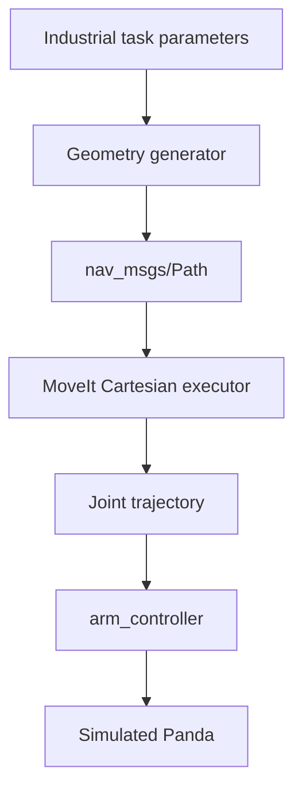

# Panda Reference Trajectories

A ROS 2 C++ package for generating reusable Cartesian reference paths and
executing validated paths on the simulated Franka Panda through MoveIt 2.

This package is designed as a library of small **motion primitives**. Complex
industrial tasks can be constructed by combining point-to-point, linear, arc,
spline, raster, approach, and retract motions instead of placing every
calculation in one large node.

> **Current scope:** the installed `reference_generator` executable publishes a
> linear Cartesian path. The other geometry generators are implemented as C++
> functions but are not yet selectable from the command line. The
> `cartesian_path_executor` can dry-run or execute a received path through
> MoveIt in simulation. This is a MoveIt baseline, not NMPC control.

## System architecture



Each layer has one responsibility:

| Layer | Responsibility | Does it move the robot? |
| --- | --- | --- |
| Geometry generator | Calculates Cartesian end-effector poses | No |
| `nav_msgs/Path` publisher | Shares and visualizes the Cartesian reference | No |
| MoveIt executor | Calculates inverse kinematics, checks the path, and creates a joint trajectory | Only when `execute:=true` |
| `arm_controller` | Sends the joint trajectory to the simulated robot | Yes |
| NMPC package | Currently evaluates a joint reference and logs proposed velocities | No; it is currently read-only |

The green path in RViz is therefore a **reference visualization**, not a robot
command.

## Why use separate generator modules?

The files in `src/generators/` are logical motion modules. They are ordinary
C++ source files rather than formal C++20 modules, but each file isolates one
type of geometry.

This structure provides:

- one responsibility per file;
- reusable motion primitives;
- smaller functions that are easier to test;
- easier identification of geometry, planning, and execution bugs;
- the ability to compare the same reference with MoveIt and future NMPC;
- simpler construction of application-level processes.

For example, a welding process can be expressed as:

```text
Point-to-point transfer
        ↓
Approach
        ↓
Linear, arc, or spline welding path
        ↓
Retract
```

If the seam geometry is wrong, inspect the selected path generator. If MoveIt
cannot reach an otherwise correct path, inspect planning, frames, orientation,
collisions, and robot limits. This separation prevents unrelated problems from
being mixed into one file.

## Package structure

```text
panda_reference_trajectories/
├── CMakeLists.txt
├── package.xml
├── README.md
├── include/panda_reference_trajectories/
│   ├── generators/path_generator.hpp
│   ├── reference_generator_node.hpp
│   └── trajectory_builder.hpp
├── src/
│   ├── reference_generator_node.cpp
│   ├── cartesian_path_executor.cpp
│   ├── trajectory_builder.cpp
│   └── generators/
│       ├── point_to_point.cpp
│       ├── linear_path.cpp
│       ├── arc_path.cpp
│       ├── spline_path.cpp
│       ├── raster_path.cpp
│       └── approach_retract.cpp
├── config/applications/
│   ├── linear_welding.yaml
│   ├── pipe_welding.yaml
│   ├── adhesive_dispensing.yaml
│   ├── polishing.yaml
│   ├── spray_painting.yaml
│   ├── surface_cleaning.yaml
│   ├── contour_inspection.yaml
│   ├── pick_and_place.yaml
│   ├── peg_insertion.yaml
│   └── machine_tending.yaml
└── launch/
    └── reference_experiment.launch.py
```

### Current implementation status

| Component | Status |
| --- | --- |
| Geometry functions in `src/generators/` | Implemented |
| Linear path publication | Implemented |
| RViz-compatible `nav_msgs/Path` | Implemented |
| MoveIt dry run | Implemented |
| MoveIt simulation execution | Implemented |
| Runtime selection of line/arc/raster/spline | Planned |
| Application YAML loading | Planned; files are currently placeholders |
| `reference_experiment.launch.py` | Planned; currently a placeholder |
| `trajectory_builder.cpp` | Planned; currently a placeholder |
| Closed-loop NMPC command output | Not part of this package and not implemented |

## Motion generator reference

All generators return:

```cpp
using Pose = geometry_msgs::msg::Pose;
using PoseSequence = std::vector<Pose>;
```

Their public declarations are collected in:

```text
include/panda_reference_trajectories/generators/path_generator.hpp
```

### Point-to-point

File:

```text
src/generators/point_to_point.cpp
```

Function:

```cpp
PoseSequence generatePointToPoint(
  const Pose & start,
  const Pose & goal);
```

It returns the start and goal poses. MoveIt decides the collision-free joint
motion between them. It does not guarantee a straight tool path.

Typical uses:

- pick-and-place transfer;
- machine tending;
- moving between work areas;
- moving to the beginning of a process path.

### Linear path

File:

```text
src/generators/linear_path.cpp
```

Function:

```cpp
PoseSequence generateLinearPath(
  const Pose & start,
  const Pose & goal,
  double step_size);
```

It interpolates equally spaced Cartesian positions:

```math
p(s) = p_{start} + s(p_{goal} - p_{start}), \qquad 0 \le s \le 1
```

The current implementation keeps the starting tool orientation constant.

Typical uses:

- straight welding;
- adhesive or sealant dispensing;
- straight cutting;
- linear inspection;
- insertion.

### Arc path

File:

```text
src/generators/arc_path.cpp
```

Function:

```cpp
PoseSequence generateArcPath(
  const Pose & center,
  double radius,
  double start_angle,
  double end_angle,
  double step_size);
```

The current implementation creates an arc in the XY plane:

```math
x = c_x + r\cos(\theta), \qquad
y = c_y + r\sin(\theta), \qquad
z = c_z
```

Typical uses:

- pipe welding;
- circular sealing;
- curved dispensing;
- inspection around a circular feature.

Current limitation: arbitrary 3D arc planes and tangent-following orientation
are not yet implemented.

### Raster path

File:

```text
src/generators/raster_path.cpp
```

Function:

```cpp
PoseSequence generateRasterPath(
  const Pose & start,
  double width,
  double height,
  double line_spacing,
  double step_size);
```

It constructs an alternating lawnmower pattern and reuses
`generateLinearPath()` for every row and connector:

```text
→ → → → →
        ↓
← ← ← ← ←
↓
→ → → → →
```

Typical uses:

- polishing;
- spray painting;
- surface cleaning;
- camera scanning;
- non-destructive inspection.

### Spline path

File:

```text
src/generators/spline_path.cpp
```

Function:

```cpp
PoseSequence generateSplinePath(
  const PoseSequence & control_points,
  unsigned int samples_per_segment);
```

It creates a Catmull-Rom spline through supplied control points. Position follows
the spline while orientation is interpolated with quaternion SLERP.

Typical uses:

- free-form welding seams;
- contour inspection;
- curved dispensing;
- smooth paths through measured feature points.

Current limitation: a Catmull-Rom spline can overshoot between control points.
MoveIt collision checking and path validation are still required.

### Approach and retract

File:

```text
src/generators/approach_retract.cpp
```

Functions:

```cpp
PoseSequence generateApproachPath(
  const Pose & target,
  double approach_distance,
  double step_size);

PoseSequence generateRetractPath(
  const Pose & target,
  double retract_distance,
  double step_size);
```

The current implementation approaches and retracts along the world Z-axis.

Typical uses:

- moving toward and away from a grasp;
- beginning and ending a weld;
- peg insertion and removal;
- approaching and leaving a work surface.

Current limitation: movement along the tool-local approach axis is not yet
implemented.

## Potential industrial applications

The primitives can eventually be composed into the following processes:

| Application | Suggested primitive sequence | Main evaluation concern |
| --- | --- | --- |
| Linear welding | PTP → approach → linear → retract | Constant speed and seam error |
| Pipe welding | PTP → approach → arc → retract | Arc accuracy and tool orientation |
| Adhesive dispensing | PTP → approach → linear/spline → retract | Smooth speed and continuous coverage |
| Polishing | PTP → approach → raster → retract | Coverage, spacing, and contact consistency |
| Spray painting | PTP → approach → raster → retract | Uniform spacing and surface coverage |
| Surface cleaning | PTP → approach → raster/spline → retract | Complete coverage and smooth turns |
| Contour inspection | PTP → approach → spline/arc → retract | Sensor pose and geometric accuracy |
| Pick-and-place | PTP → approach → grasp → retract → PTP → place | Collision-free transfer and cycle time |
| Peg insertion | PTP → approach → short linear insertion → retract | Alignment, low speed, and constraints |
| Machine tending | PTP → approach → load/unload → retract | Repeatability and safe transfers |

These compositions describe the intended architecture. The current executable
publishes only a linear path; application sequencing is the next extension.

## Build

From the workspace root:

```bash
cd ~/panda_franka_robot
source /opt/ros/jazzy/setup.bash

colcon build \
  --packages-select panda_reference_trajectories \
  --symlink-install \
  --cmake-clean-cache

source install/setup.bash
```

Verify both executables:

```bash
ros2 pkg executables panda_reference_trajectories
```

Expected:

```text
panda_reference_trajectories cartesian_path_executor
panda_reference_trajectories reference_generator
```

## Run a safe linear-path test in Gazebo

Use three terminals. Test with `execute:=false` before allowing motion.

### Terminal 1 — simulation, MoveIt, and controllers

```bash
cd ~/panda_franka_robot
source /opt/ros/jazzy/setup.bash
source install/setup.bash

ros2 launch panda_bringup pick_and_place.launch.xml
```

This top-level launch already starts MoveIt. Do not start a second standalone
MoveIt launch.

Verify the controller:

```bash
ros2 control list_controllers
ros2 action list | grep arm_controller
```

Required results include an active `arm_controller` and:

```text
/arm_controller/follow_joint_trajectory
```

### Terminal 2 — dry-run executor

```bash
cd ~/panda_franka_robot
source /opt/ros/jazzy/setup.bash
source install/setup.bash

ros2 run panda_reference_trajectories cartesian_path_executor \
  --ros-args \
  -p use_sim_time:=true \
  -p execute:=false \
  -p wait_timeout:=60.0
```

The executor waits for one path, plans an approach to its first point, previews
the Cartesian segment from the planned approach endpoint, checks the completion
fraction, and exits. No motion is executed in dry-run mode.

### Terminal 3 — publish a small path

Stop old generators first:

```bash
pkill -INT -f 'install/panda_reference_trajectories/lib/panda_reference_trajectories/reference_generator'
pgrep -af reference_generator || echo "No old reference generator is running"
```

Start exactly one generator:

```bash
cd ~/panda_franka_robot
source /opt/ros/jazzy/setup.bash
source install/setup.bash

ros2 run panda_reference_trajectories reference_generator \
  --ros-args \
  -r __node:=cartesian_reference_generator \
  -p use_sim_time:=true \
  -p frame_id:=panda_link0 \
  -p start_x:=0.45 \
  -p start_y:=-0.05 \
  -p start_z:=0.55 \
  -p goal_x:=0.45 \
  -p goal_y:=0.05 \
  -p goal_z:=0.55 \
  -p step_size:=0.01
```

Expected generator output:

```text
Linear Cartesian reference generated with ... waypoints.
Publishing: /panda_reference/cartesian_path
```

Expected executor output includes:

```text
Received ... waypoints in frame 'panda_link0'
Planning an approach to the first waypoint
Cartesian path completion: 100.00%
Dry run successful. No motion was executed.
```

Do not execute a path whose completion fraction is below the configured
`minimum_fraction`.

## Execute the validated path in Gazebo

After a successful dry run, start a new executor:

```bash
ros2 run panda_reference_trajectories cartesian_path_executor \
  --ros-args \
  -p use_sim_time:=true \
  -p execute:=true \
  -p velocity_scaling:=0.1 \
  -p acceleration_scaling:=0.1 \
  -p wait_timeout:=60.0
```

The generator republishes once per second, so the new executor should receive
the current path. The expected sequence is:

1. MoveIt plans a point-to-point approach to the first waypoint.
2. The Panda moves to that waypoint.
3. MoveIt calculates the Cartesian segment.
4. The executor rejects an incomplete or empty trajectory.
5. A valid trajectory is executed through `arm_controller`.

Use this command in simulation only. Physical FR3 execution requires a separate
hardware-specific review of descriptions, frames, groups, controller names,
limits, collision objects, recovery behavior, and operator safety.

## Parameters

### Reference generator

| Parameter | Default | Meaning |
| --- | ---: | --- |
| `frame_id` | `panda_link0` | Coordinate frame for the path |
| `start_x` | `0.40` | Start X position in metres |
| `start_y` | `-0.15` | Start Y position in metres |
| `start_z` | `0.35` | Start Z position in metres |
| `goal_x` | `0.40` | Goal X position in metres |
| `goal_y` | `0.15` | Goal Y position in metres |
| `goal_z` | `0.35` | Goal Z position in metres |
| `step_size` | `0.005` | Approximate waypoint spacing in metres |

The generator currently publishes to the fixed topic:

```text
/panda_reference/cartesian_path
```

It uses reliable, transient-local QoS and also republishes once per second.

### Cartesian executor

| Parameter | Default | Meaning |
| --- | ---: | --- |
| `path_topic` | `/panda_reference/cartesian_path` | Input Cartesian path |
| `planning_group` | `arm` | MoveIt planning group |
| `execute` | `false` | Execute when true; dry-run when false |
| `move_to_start` | `true` | Plan an approach to the first waypoint |
| `keep_current_orientation` | `true` | Replace waypoint orientations with current tool orientation |
| `avoid_collisions` | `true` | Enable collision checking |
| `velocity_scaling` | `0.1` | MoveIt velocity scale in `(0,1]` |
| `acceleration_scaling` | `0.1` | MoveIt acceleration scale in `(0,1]` |
| `eef_step` | `0.01` | Cartesian interpolation resolution in metres |
| `minimum_fraction` | `0.99` | Minimum accepted Cartesian completion |
| `planning_time` | `10.0` | Allowed planning time in seconds |
| `wait_timeout` | `30.0` | Time to wait for a path in seconds |

## Inspect the ROS interfaces

```bash
ros2 topic info /panda_reference/cartesian_path --verbose
ros2 topic echo /panda_reference/cartesian_path --once
ros2 node list | grep -E 'reference|cartesian'
ros2 control list_controllers
```

The desired state while testing is one reference-generator publisher. Multiple
generators can publish different paths to the same topic, causing the RViz line
to alternate or appear to swing.

## Troubleshooting

| Symptom | Likely cause | Action |
| --- | --- | --- |
| `Unknown topic /panda_reference/cartesian_path` | Generator is not running or has exited | Start `reference_generator` and check the ROS domain |
| `Publisher count: 0` | No active generator | Start exactly one generator |
| RViz line swings between positions | Multiple generators publish different paths | Find them with `pgrep -af reference_generator`, then stop old instances |
| Path disappears after `pkill` | The path publisher was stopped | Restart one generator; disappearance is expected |
| `No Cartesian path received` | Topic/domain mismatch or generator not running | Check topic name, `ROS_DOMAIN_ID`, and publisher count |
| Cannot obtain current state | `/joint_states`, MoveIt, or simulation is unavailable | Check the simulation and `ros2 topic echo /joint_states --once` |
| Approach planning fails | First pose is unreachable, colliding, or has a frame/orientation problem | Use a nearer pose and verify `panda_link0` |
| Cartesian fraction below 99% | Part of the path is unreachable or colliding | Shorten the path, increase clearance, or inspect constraints |
| Robot does not move in dry run | `execute:=false` intentionally prevents motion | Run `execute:=true` only after validation |
| Duplicate MoveIt/RViz nodes | The top-level stack and standalone MoveIt were both launched | Keep only `pick_and_place.launch.xml` |

## Relationship to NMPC

The current motion path is:

```text
Cartesian generator
    -> MoveIt planning
    -> arm_controller
    -> simulated Panda
```

This is the baseline without NMPC command output. The current
`panda_nmpc/nmpc_node.py` is read-only: it calculates tracking error and
proposed joint velocities but does not command the robot.

A future comparison can use the same application paths to measure:

- joint and Cartesian tracking error;
- cycle time;
- velocity and acceleration smoothness;
- constraint violations;
- disturbance recovery;
- NMPC solver time;
- success rate over repeated trials.

## Recommended next extensions

1. Add a `path_type` parameter to select line, arc, raster, spline, PTP, or
   approach/retract at runtime.
2. Populate and load the application YAML profiles.
3. Implement `reference_experiment.launch.py` to start a selected experiment.
4. Compose several primitives into complete industrial processes.
5. Publish or record the generated MoveIt joint trajectory for controlled
   comparison with NMPC.
6. Add automated geometry tests before enabling physical hardware.
7. Extend arcs to arbitrary 3D planes and approach/retract along the tool axis.

## Design rule

> Generators describe **where the tool should travel**. MoveIt determines
> **whether and how the robot joints can follow that geometry**. The controller
> executes the joint trajectory. NMPC can later optimize tracking of the same
> reference.
